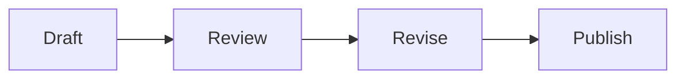
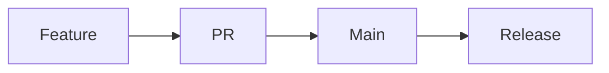

<!-- card -->

```yaml
id: a1b2c3d4
difficulty: 0
last_reviewed: 2026-04-20
```

## Front

What is the capital of France?

## Back

**Paris.**

<!-- /card -->

<!-- card -->

```yaml
id: b2c3d4e5
difficulty: 2
last_reviewed: 2026-04-21
```

## Front

What does the `===` operator check in JavaScript?

## Back

**Strict equality** — it checks both **value** and **type** without type coercion.

```js
1 == "1"; // true  (loose)
1 === "1"; // false (strict)
```

<!-- /card -->

<!-- card -->

```yaml
id: c3d4e5f6
difficulty: 3
last_reviewed: 2026-04-15
```

## Front

What is shown in the image below?


## Back

This card demonstrates local image support from the `assets/` folder.

- Markdown image syntax works on a card face.
- Relative asset paths stay local to the app.

<!-- /card -->

<!-- card -->

```yaml
id: d4e5f6a7
difficulty: 4
last_reviewed: 2026-05-01
```

## Front

What workflow does this Mermaid diagram describe?



## Back

It shows a simple editorial loop: draft, review, revise, then publish.

<!-- /card -->

<!-- card -->

```yaml
id: e5f6a7b8
difficulty: 5
last_reviewed: 2026-05-01
```

## Front

How does a feature branch usually move toward release?

## Back

One common path looks like this:



That keeps Mermaid coverage on the back face too.

<!-- /card -->

<!-- card -->

```yaml
id: f6a7b8c9
difficulty: 2
last_reviewed: 2026-05-01
```

## Front

Differentiate $f(x) = x^3 - 4x$ and evaluate $f'(2)$.

## Back

$$
f'(x) = 3x^2 - 4
$$

So $f'(2) = 3(2^2) - 4 = 8$.

This card starts at difficulty `0`, which means it is skipped until you include **Skip (0)** in the live filter.

<!-- /card -->

<!-- card -->

```yaml
id: 0a1b2c3d
difficulty: 2
last_reviewed: 2026-05-01
```

## Front

Evaluate the definite integral:

$$
\int_0^1 2x\,dx
$$

## Back

The area is $1$ because $\int_0^1 2x\,dx = [x^2]_0^1 = 1$.

<!-- /card -->

<!-- card -->

```yaml
id: 1b2c3d4e
difficulty: 0
last_reviewed: 2026-04-12
```

## Front

Which line below is code rather than a real section heading?

```md
## Back is part of this code fence
- bullet one
- bullet two
```

Also compare these Markdown building blocks:

| Syntax | Use |
| --- | --- |
| `> quote` | blockquote |
| ```` ```js ```` | fenced code |

## Back

The `## Back` line inside the fence is plain text, not the section delimiter.

> This card exists to show parser-safe fenced content plus tables and blockquotes.

<!-- /card -->
