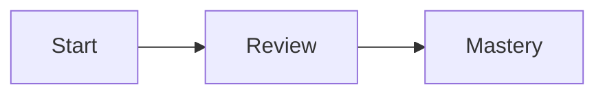

# Markdown Flashcards

A local-first flashcard app backed entirely by a single Markdown file.

Markdown Flashcards keeps the deck in `cards.md`, serves a clean browser UI, and writes card metadata straight back into the file. Session settings now live in the UI at runtime, so you can change order, reviewed visibility, and visible difficulty levels without editing file-level config or restarting the app.

## Features

- **Local-first & private:** Runs completely on your machine. No cloud sync, no tracking, complete data ownership.
- **Plain-text source of truth:** Your whole deck lives in `cards.md`, which stays readable, editable, and version-control friendly.
- **Live runtime controls:** Filter visible difficulties, hide reviewed-today cards, and switch between file order and a stable shuffle directly in the UI.
- **Skip via difficulty `0`:** Use difficulty `0` as “skip for now” without introducing a separate skip flag.
- **Rich card rendering:** Standard Markdown, Mermaid diagrams, KaTeX math, code blocks, tables, lists, and local images all render inside cards.
- **No hidden database:** App-managed metadata such as `difficulty` and `last_reviewed` stays in each card’s YAML block.

### Landing Page


### Study Mode


## Quick start

1. Install dependencies:
   ```bash
   npm install
   ```
2. Start the app:
   ```bash
   npm start
   ```
3. Open in your browser:
   `http://localhost:54123`

## Writing Cards

At a minimum, each card needs a front and a back wrapped in HTML `<!-- card -->` markers.

```markdown
<!-- card -->

## Front

What does the `===` operator check in JavaScript?

## Back

Strict equality — it compares both value and type.

<!-- /card -->
```

### Card metadata

Once the app has run, cards usually include a YAML metadata block like this:

````markdown
<!-- card -->

```yaml
id: a1b2c3d4
difficulty: 3
last_reviewed: 2026-04-26
```

## Front

...
````

These fields are managed entirely by the app, so you do not have to author them yourself:

- `id` — stable card identifier
- `difficulty` — current `0–5` rating, where `0` means “skip”
- `last_reviewed` — last date the card was marked reviewed

## Live study settings

The runtime session is now owned by the UI rather than `cards.md` frontmatter.

- **Order:** switch between file order and a stable shuffle.
- **Reviewed visibility:** show reviewed-today cards or hide them immediately after review.
- **Visible difficulties:** choose which difficulty levels stay in the live cycle.
- **Skip (0):** hidden by default, but can be brought back instantly by enabling difficulty `0` in the filter.
- **Study snapshot:** `Ready now` follows the live filters, while `Reviewed today` and `Skipped cards` reflect the whole deck.

The default live view is:

- shuffled order
- reviewed cards visible
- visible difficulties `1–5`
- skipped cards (`0`) hidden

### Legacy note

Older decks may still contain a file-level YAML block at the top of `cards.md` or legacy fields such as `paused`. The app ignores those runtime settings now, and any legacy file-level block is dropped the next time the file is rewritten.

## Mermaid and math inside cards

Both sides of a card can include Mermaid and KaTeX-friendly math content.

````markdown
<!-- card -->

## Front

Render this flow:



## Back

Euler says $e^{i\pi} + 1 = 0$.

<!-- /card -->
````

## Development & project structure

- `public/` — browser UI (HTML, CSS, JS frontend)
- `src/` — parser, startup, and persistence logic
- `test/` — automated test suite and fixtures
- `assets/` — local images or other static files referenced by cards
- `logs/` — run logs created by the app
- `.bak/` — timestamped backups of your `cards.md` generated automatically

### Helpful commands

- `npm run dev` — start with watch mode
- `npm test` — run the automated test suite

Please read `spec.md` before changing behavior so the product, parser, docs, and tests stay aligned.
